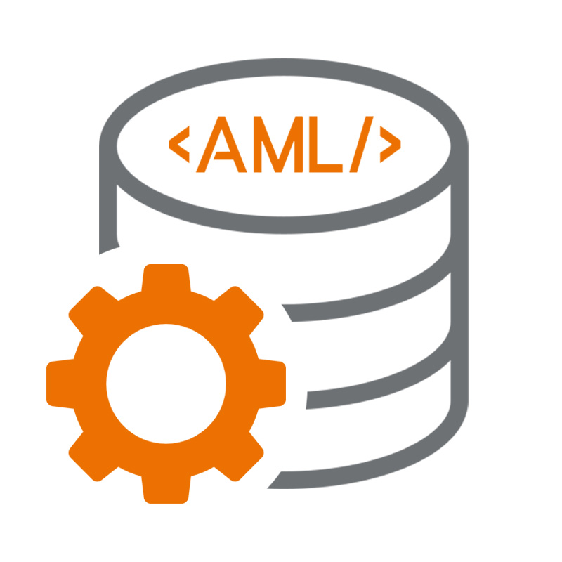

# AML NoSQL Database Management

Welcome to the AML NoSQL Database Management Project.

### Contributors:
- [Jonas Bihr](https://github.com/Rhib)
- [Namid Marxen](https://github.com/NamidM)
- [Johannes Emanuel Timter](https://github.com/UdolfSeelenfrost)
- [Nils-Christopher Wiesenauer](https://github.com/NurNils)

### Wiki:
1. [SRS (System Requirements Specification)](https://github.com/NurNils/TINF19C_Team_5_AML_Database_Management/wiki/1.-SRS-(System-Requirements-Specification))
2. [SAS (System Architecuture Specification)](https://github.com/NurNils/TINF19C_Team_5_AML_Database_Management/wiki/2.-SAS-(System-Architecuture-Specification))
3. [MODs (Modul Documentations)](https://github.com/NurNils/TINF19C_Team_5_AML_Database_Management/wiki/3.-MODs-(Modul-Documentations))
4. [MM (Meeting Minutes)](https://github.com/NurNils/TINF19C_Team_5_AML_Database_Management/wiki/4.-MM-(Meeting-Minutes))
5. [User Manual](https://github.com/NurNils/TINF19C_Team_5_AML_Database_Management/wiki/5.-User-Manual)
6. [Systemtestplan](https://github.com/NurNils/TINF19C_Team_5_AML_Database_Management/wiki/6.-Systemtestplan)
7. [Systemtestreport](https://github.com/NurNils/TINF19C_Team_5_AML_Database_Management/wiki/7.-Systemtestreport)

## About the project

The project was developed by DHBW students in the 3rd semester during the lecture Software Engineering.
The main purpose of the software will be to upload AutomationML files to a database. The uploaded files can be accessed from the user through a web interface. In that interface the user is also able to edit, delete and download existing files. He should also have the ability to search for saved documents. This provides the user with an easy way to upload AutomationML files into a database and conveniently handle them through a web interface.

## Subprojects

### Frontend (Angular GUI)

Wikilink: [Frontend](https://github.com/NurNils/TINF19C_Team_5_AML_Database_Management/tree/master/SOURCE/FRONTEND)

### Backend (NodeJS with ExpressJS)

Wikilink: [Backend](https://github.com/NurNils/TINF19C_Team_5_AML_Database_Management/tree/master/SOURCE/BACKEND)

## Technologies

The system is based on the MEAN (MongoDB, Express.js, Angular, Node.js)-Stack with the CRUD (Create, Read, Update, Delete) functionality in the backend.

### MongoDB:

MongoDB is a document-oriented NoSQL database used for high volume data storage.

### ExpressJS:

ExpressJS is the most popular Node web framework and is the underlying li-brary for several other popular Node web frameworks. It provides many mechanisms.

### Angular:

Angular is a TypeScript based front-end framework which is published as open source software.

### NodeJS:

NodeJS is a JavaScript free and open source cross-platform for server-side programming that allows users to build network applications quickly.
